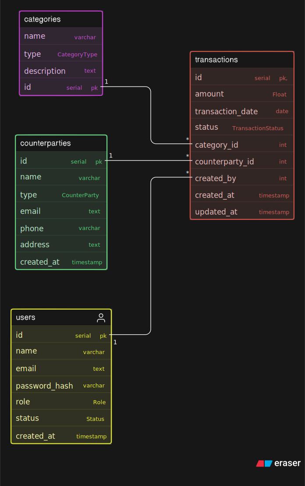

# Zorvyn Finance Tracker - Backend API

This is the backend for the Zorvyn Finance Dashboard. It is built to be clean, secure, and ready for production. The goal of this project is to manage users, roles, and financial records securely while providing summary analytics for a frontend dashboard.

## What We Have Implemented

We have implemented all the core requirements and optional enhancements from the assignment guidelines in the best way possible:

1. **User and Role Management (Role-Based Access Control)**:
   - We set up three strict roles: `Viewer`, `Analyst`, and `Admin`.
   - **How it works**: Instead of writing one messy function to check roles for every route, we created separate, reusable middleware checkpoints (`block_viewer` and `require_admin`). 
   - **Why it's better**: This makes the code much cleaner and prevents security mistakes when adding new features later. 
   - *Viewers* can only see summary data. *Analysts* can view specific transactions and trends. *Admins* have full control to create, update, and delete everything.

2. **Financial Records & Dashboards**:
   - Built complete CRUD (Create, Read, Update, Delete) APIs for transactions, categories, and counterparties.
   - Designed specialized Dashboard APIs to fetch summaries like "Monthly Trends", "Total Expenses", and "Recent Activity".

3. **Global Rate Limiting (Extra Security)**:
   - Added a security measure that stops users or bots from sending too many requests and crashing the system (limited to 25 requests per minute per user).

4. **Input Validation & CORS Handling**:
   - Used the Rust `validator` library to check incoming data before it even reaches our database. This automatically rejects bad email formats or missing data with clear error messages.
   - Fully enabled **Cross-Origin Resource Sharing (CORS)** via `tower-http`. This means any frontend framework (React, Vue, or completely separate local host ports) can talk to this backend safely without throwing "Failed to fetch" browser issues!

5. **JWT Authentication**:
   - Users get a secure JWT token when they sign in. All protected API routes verify this token automatically to ensure only logged-in users can access the data.

6. **Automatic Database Migrations**:
   - We used `sqlx` to embed our PostgreSQL database tables directly into the backend code. When you start the server, it automatically sets up the database tables for you. You don't have to run any extra commands to construct the database!

7. **Asynchronous Code & Logging**:
   - The application manages data quickly without freezing. We also added logging that saves server activities into files so we can track errors easily.

8. **Docker Support (One-Click Setup)**:
   - We created a `docker-compose.yml` and a multi-stage `Dockerfile`.
   - This means you don't even need to install Rust or PostgreSQL on your computer. You just need Docker, and you can run the entire project with one simple command!

## Project Structure Explained

Here is a simple breakdown of how the code is organized:

- `./migrations`: Contains the SQL scripts to create the database tables.
- `docker-compose.yml`: Tells Docker how to start both the PostgreSQL database and our Backend Server together smoothly.
- `public/`: Contains the Swagger API documentation HTML and the visual Database ER diagram.
- `src/controllers`: These files handle the actual API requests. They take the data from the user and respond with success or error messages.
- `src/middlewares`: Contains our security checkpoints (Rate Limiting, JWT Token Checker, and Role-Based Access Guards) that run *before* the controllers.
- `src/models`: Defines exactly what our data looks like (like the Transaction or User structures) and handles the validation logic.
- `src/routes`: Connects URLs (like `/transaction` or `/users`) safely to their respective controllers.
- `src/services`: Handles the heavier logic, like explicitly connecting to PostgreSQL and writing database queries, or checking passwords.

## How to Run the Project

Because the project is fully Dockerized, you can start everything (the database and the server) with just one command. Make sure you have Docker Desktop installed, then run:

```bash
docker compose up --build -d
```
*(The backend will wait for the database to boot, set up the tables automatically, and then prepare the server on port 7878)*

## API Documentation
You can explore the interactive API documentation and test the routes directly in your browser!
Once the project is running using Docker, open this link:
**[http://localhost:7878/docs](http://localhost:7878/docs)** 

## Database Schema Model

